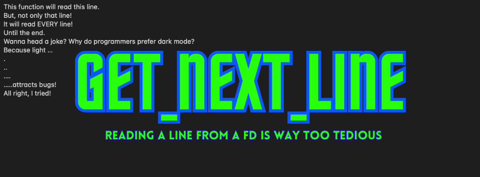
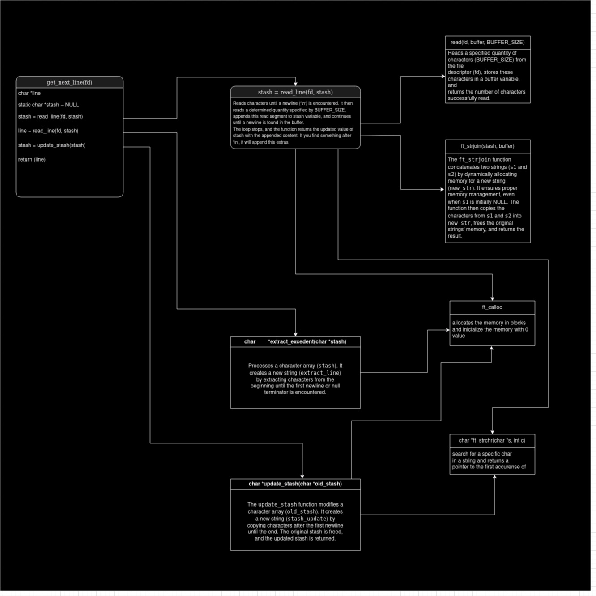

# get_next_line



"This project is about reading lines from file descriptors. It will be very, very useful in the future (believe me)."
## Table of Contents

- [Introduction](#introduction)
- [Usage](#usage)
- [Files within the project](#files-within-the-project)
- [How does the algorithm work?](#how-does-the-algorithm-work)
- [Bonus](#bonus)
- [License and friendly advice](#license-and-friendly-advice)

## Introduction
This is a project that is part of the 42 common core curriculum.  
The purpose is to develop a program that reads a line from a file descriptor and returns it.  
In the bonus part, we essentially need to be able to do this with more than one file descriptor without losing the value of the last one.
For more details, read the [subject](subject/subject.pdf).
>The code was written according to the 42 norm guidelines (norminette).

## Usage
To use the get_next_line in your project, follow these steps:
1. Clone the repository
```bash
git clone git@github.com:amauricoder/42_get_next_line.git
```
2. Compile the files
```bash
cc -Wall -Wextra -Werror sources/*.c -o get_next_line 
```
This will generate the get_next_line file in the root folder.

3. If you want to use as an external function, go to your header file and include the get_next_line.h to your header
```C
# include "get_next_line.h"
```

For Bonus:
1. Compile the files
```bash
cc -Wall -Wextra -Werror bonus/*.c -o get_next_line_bonus 
```
This will generate the get_next_line_bonus file in the root folder.
2. If you want to use as an external function, go to your header file and include the get_next_line.h to your header
```C
# include "get_next_line_bonus.h"
```

## Files within the project
Please note, while reading the subject, that we have some limitations.
For this project, the subject asks for 3 files:
- get_next_line.c -> Contains the main function and some auxiliaries.
- get_next_line_utils.c -> Contains more auxiliaries.
- get_next_line.h -> Header of the functions.
For the bonus part is basically the same, only changing the name of the files with a _bonut at the end.

## How does the algorithm work?
Below, I have a simple diagram that illustrates the workflow and explains the functioning of the algorithm.


## Bonus
For the bonus part, the solution remains essentially the same. However, a crucial enhancement involves defining the static variable as an array. This ensures that the last value from a specific file descriptor (fd) is preserved when calling the function for another. This modification to the static variable within the code guarantees consistent behavior.

## License and friendly advice
[View License](LICENSE)

Get_Next_Line can read lines, but it can't write them. However, YOU CAN!
I recommend that you don't copy and paste code that you don't comprehend 100% and can't recreate from scratch. 
Doing this goes against the purpose of the school and gives you a false sense of confidence that you know something that you actually don't.
If you've reached this project, you can do A LOT MORE! 
Good luck!
